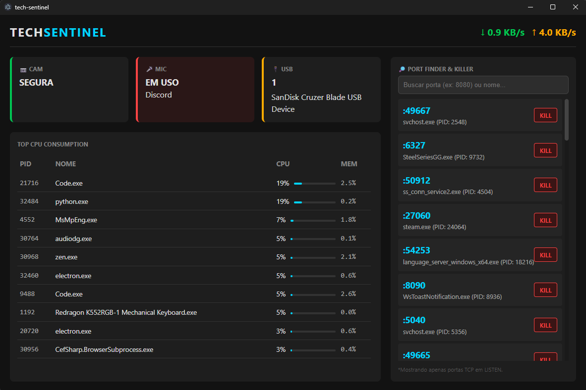

# 🛡️ TechSentinel


> **TechSentinel** is a desktop dashboard for real-time hardware monitoring and privacy awareness. It bridges the gap between low-level system data and a modern UI, alerting users about active webcams, microphones, and USB devices while monitoring network traffic and process consumption.



## 🚀 Features

### 🔒 Privacy & Security
- **Webcam & Microphone Monitor:** Real-time detection of hardware usage. Identify exactly which application (e.g., Zoom, Chrome) is accessing your camera or mic via Windows Registry analysis.
- **USB Watchdog:** Instant detection of external storage devices connected to the machine.

### ⚡ System Performance
- **Process Manager:** Visualizes top CPU-consuming processes, filtering out system idle noise.
- **Network Speed:** Real-time Upload/Download speedometer.
- **Port Finder:** Search for open TCP ports (LISTEN status) and identify the PID/Process owner. Includes a built-in safety lock for terminating processes.

### 🎨 UI/UX
- Dark mode interface with responsive grid layout.
- Dynamic color changes based on threat levels (Safe/Warning/Danger).

## 🛠️ Tech Stack

This project uses a Hybrid Architecture combining the ecosystem of Node.js with the system-level power of Python.

* **Core:** [Electron](https://www.electronjs.org/) (Main Process)
* **Frontend:** [React](https://reactjs.org/) + [Vite](https://vitejs.dev/)
* **Backend/Engine:** [Python 3](https://www.python.org/)
* **Python Libraries:**
    * `psutil` (Process & System utilities)
    * `pywin32` (Windows API access)
    * `wmi` (Windows Management Instrumentation)
* **Communication:** JSON over Stdio (IPC between Node.js and Python)

## 🏗️ Architecture Overview

The application runs two main parallel processes:
1.  **Electron (Node.js):** Handles the window management and renders the React UI. It spawns the Python script as a child process.
2.  **Python Engine:** Runs in the background, polling system APIs (Registry, WMI, Kernel) every 1.5 seconds and sending a JSON payload to the Frontend via Standard Output.

## 📦 Installation & Setup

Prerequisites: **Node.js** and **Python 3** installed.

1.  **Clone the repository**
    ```bash
    git clone https://github.com/MatheusCampagnolo/tech-sentinel.git
    cd tech-sentinel
    ```

2.  **Install Node dependencies**
    ```bash
    npm install
    ```

3.  **Setup Python Environment**
    ```bash
    # Create virtual environment
    python -m venv venv

    # Activate venv (Windows)
    .\venv\Scripts\activate

    # Install Python dependencies
    pip install -r requirements.txt
    ```

4.  **Run Development Mode**
    ```bash
    npm run dev
    ```
    *This will launch the Vite server and the Electron window simultaneously.*

## 🤝 Contributing

Contributions are welcome! Please open an issue or submit a pull request for any improvements.

## 📝 License

This project is licensed under the [MIT License](LICENSE).